# Criação de VM Linux na Azure

Este tutorial ensina como criar um VM na Azure. Como pŕe requisito, você deverá ter uma subscrição válida em sua conta Azure. É possível criar uma subscrição para estudantes com o seu email FIAP e garantir um crédito de USD 100 sem a necessidade da entrada de informações de cartão de crédito. Este valor será mais do que suficiente para as atividades desenvolvidas nesta disciplina.

Para criar a sua conta de estudante acesse o link abaixo e siga as instruções. Não esqueça de utilizar o seu email FIAP para fazer o login na conta da microsoft:

​	[Azure for Students](https://azure.microsoft.com/pt-br/free/students/)

**Atenção**: É altamente recomendado que você delete a sua VM ao final de cada atividade. Além de garantir que seus créditos não sejam desperdiçados, você ainda ficará craque e ágil nas criação de VMs...

## Criando sua Virtual Machine

Para iniciar a criação da VM, acesse o [Portal da Azure](https://portal.azure.com/#home) e siga os passos a seguir:

1. Clique no ícone para mostrar o menu do portal no canto superior esquerdo:

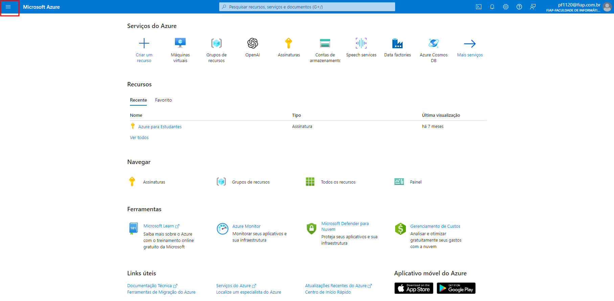

2. Clique em Virtual Maquinas Virtuais:

   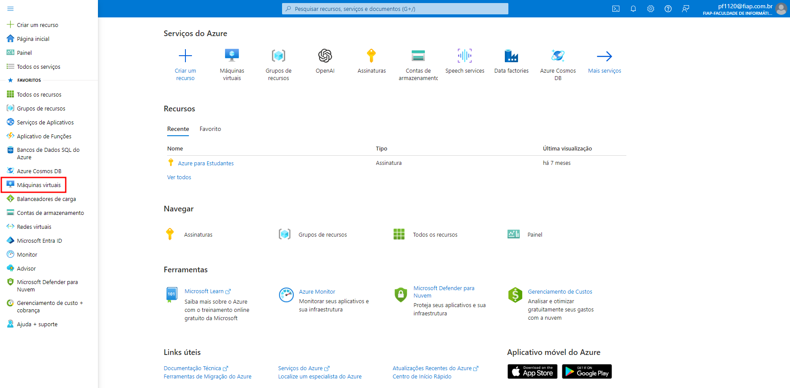

3. No canto superior direito clique em **Criar**  e depois em **Máquina rirtual do Azure**:

   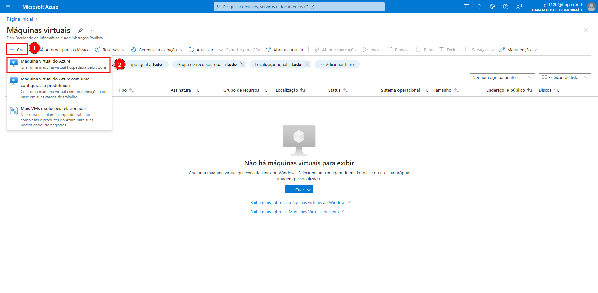

4. Na seção **Detalhes do projeto**, configure a *Assinatura* e o *Grupo de recursos*. Caso ainda não tenha um *Grupo de recursos*, crie um novo:

   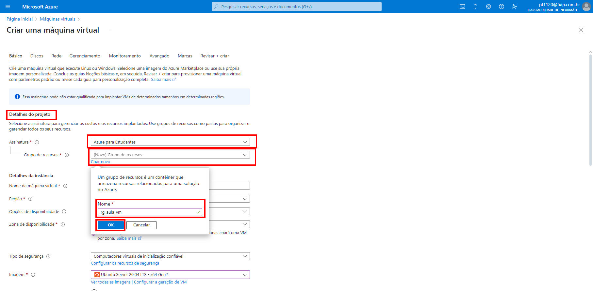

5. Na seção **Detalhes da instância** escolha um nome para sua VM, uma região, uma imagem e um tamanho (configuração de hardware).

   **Observações** :
   - Tome cuidado com a opção de tamanho pois poderá gerar um custo muito alto.
   - De acordo com a utilização da VM, avalie habilitar a opção *Executar com desconto de Spot do Azure*

   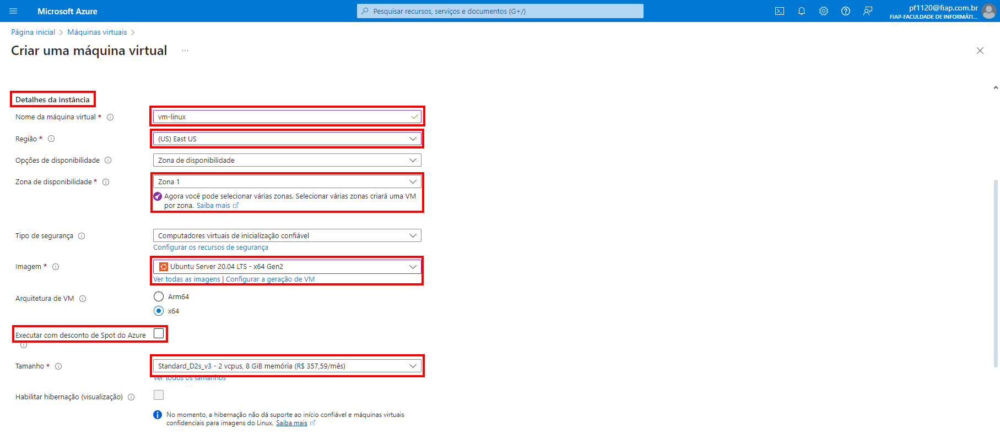

6. Na seção **Conta de administrador** escolha a opção SSH public key. Providencie um nome de usuário e deixe que a Azure crie o par  de chaves pública e privada para você. No final da criação da VM você sera orientado a fazer o download da chave privada. Guarde essa chave em local seguro e lembre-se de que sem ela, não será possível acessar a sua VM.

   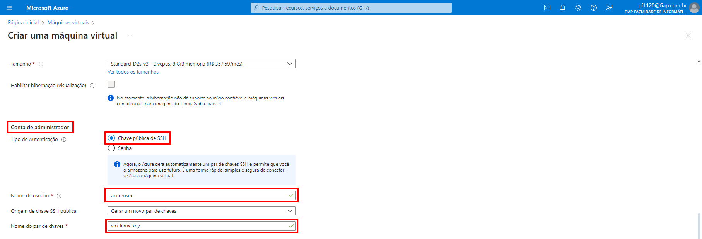

7. Em **Regras de portas de entrada**  deixe a opção padrão *Allow selected ports*, com o SSH (22) selecionado (você também pode selecionar outras portas, caso haja necessidade).

   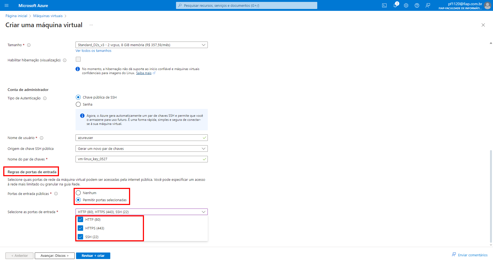

8. Clique no botão *Revisar + Criar*:

   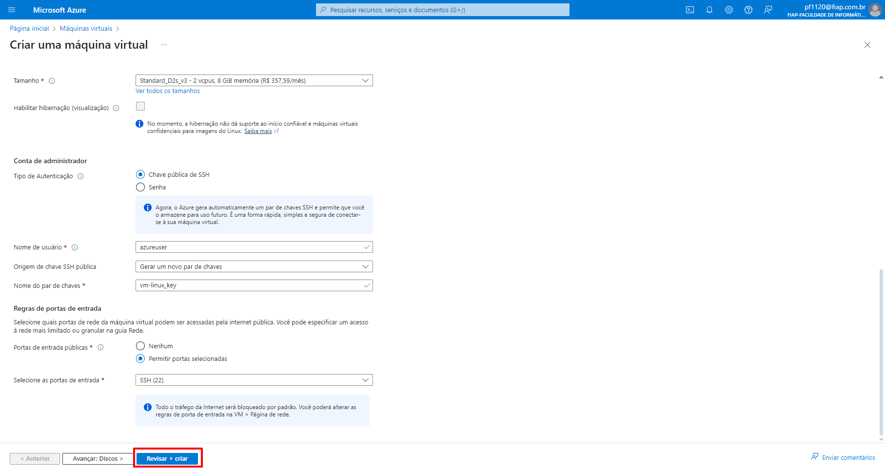

9.  Verifique todos os parâmetros de criação da VM e clique no botão Create caso esteja tudo correto:

   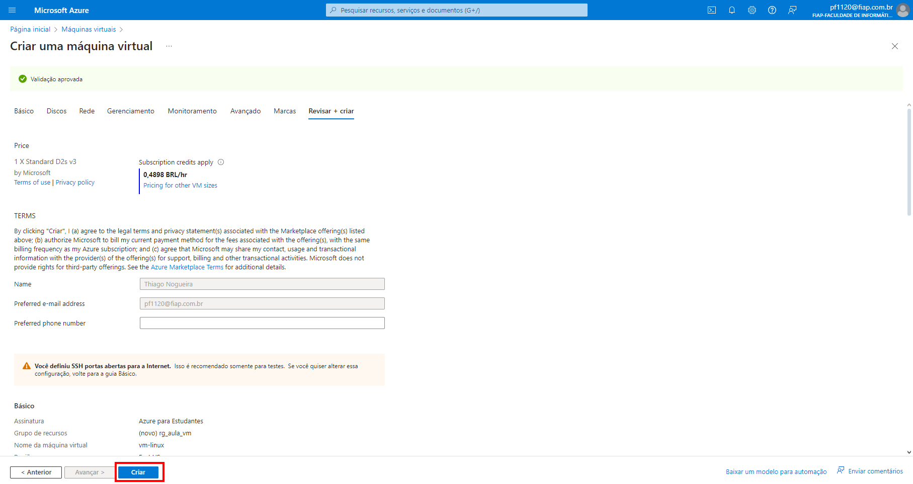

10. Clique no botão **Baixar chave privada e criar recurso**:
    **Importante**: Esta chave será necessária para que você possa acessar a VM. Salve a chave e não compartilhe com ninguém.

   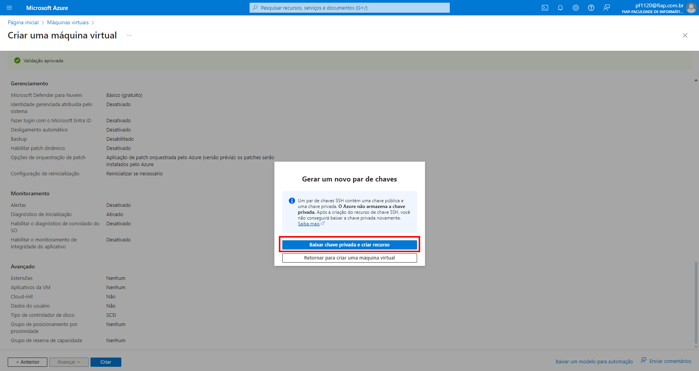

11. Aguarde um tempo até que a VM seja criada. Se tudo ocorrer certo, você receberá uma mensagem confirmando que o *deploy* está completo. Para exibir os detalhes da VM, clique em **Ir para o recurso**:

   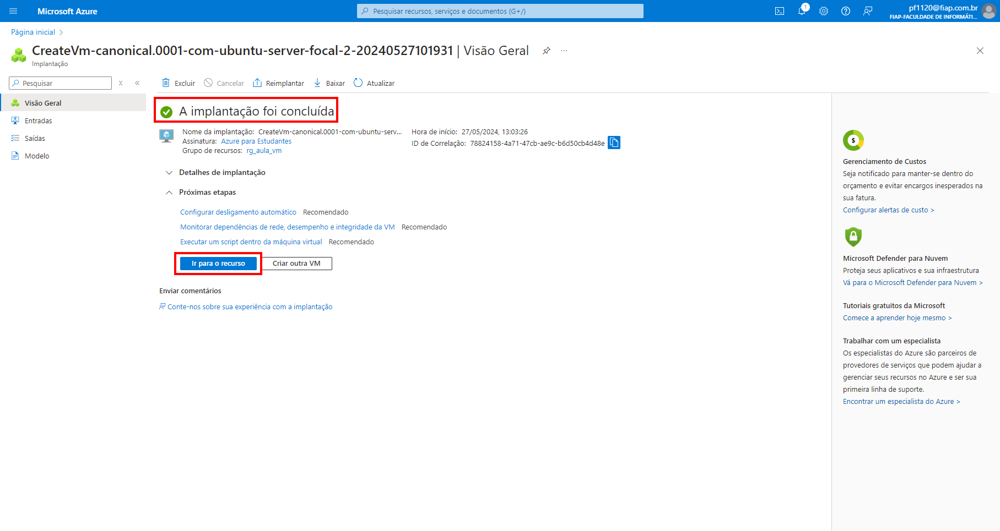

12. Neste painel é possível visualizar e alterar as configuraçẽose estado de sua VM. Aproveite e anote o endereço público de IP, pois essa informação será necessária para acessar a VM posteriormente

    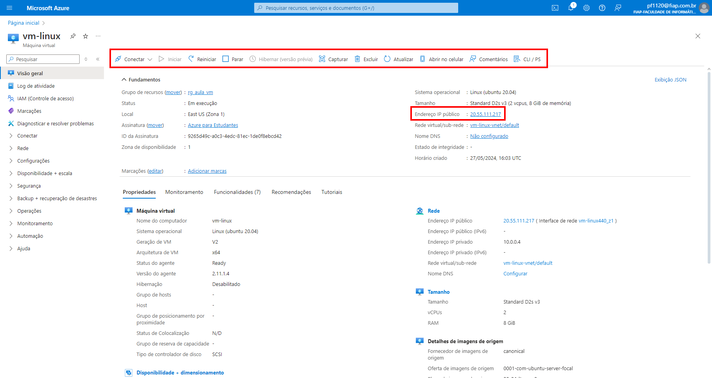

## Acessando a sua VM

Agora que você criou a sua VM com sucesso, vamos acessá-la atravś de uma conexão SSH. Para isso, utilizaremos um cliente SSH chamado MobaXterm. Caso ainda não o tenha instalado em sua máquina, utilize o link abaixo para fazer o download. Se tiver restrições para instalar programas em seu computador, você deve optar pela utilização da versão portable. Neste caso, basta fazer o download, descompactar o arquivo e iniciar diretamente o executável.

[Download MobaXterm](https://mobaxterm.mobatek.net/download-home-edition.html)

1. Para criar uma nova sessão de SSH, abra o MobaXterm e clique em **Session**:
   

2. Na nova janela, adicione o ip da VM no campo **Remote Host**. Habilite a opção **Specify Username** e adicione o nome do usuário utilizado no cadastrado na SSH key.
   

3. Clique na aba **Advanced Settings** e habilite a opção **Use private key**. Clique no ícone deste campo e carregue o arquivo com a sua SSH private key.
   

4. Clique na aba **Bookmark Settings**, de um nome adequado para a sua sessão e clique em ok.
   

5. O MobaXterm deverá agora se conectar automaticamente ao servidor. Se tudo der certo, você verá uma tela similar a apresentada abaixo:
   

6. Nas próximas que você abrir o MobaXterm, a sua sessão estará disponível na aba esquerda. Basta clicar duas vezes para se conectar:
   
